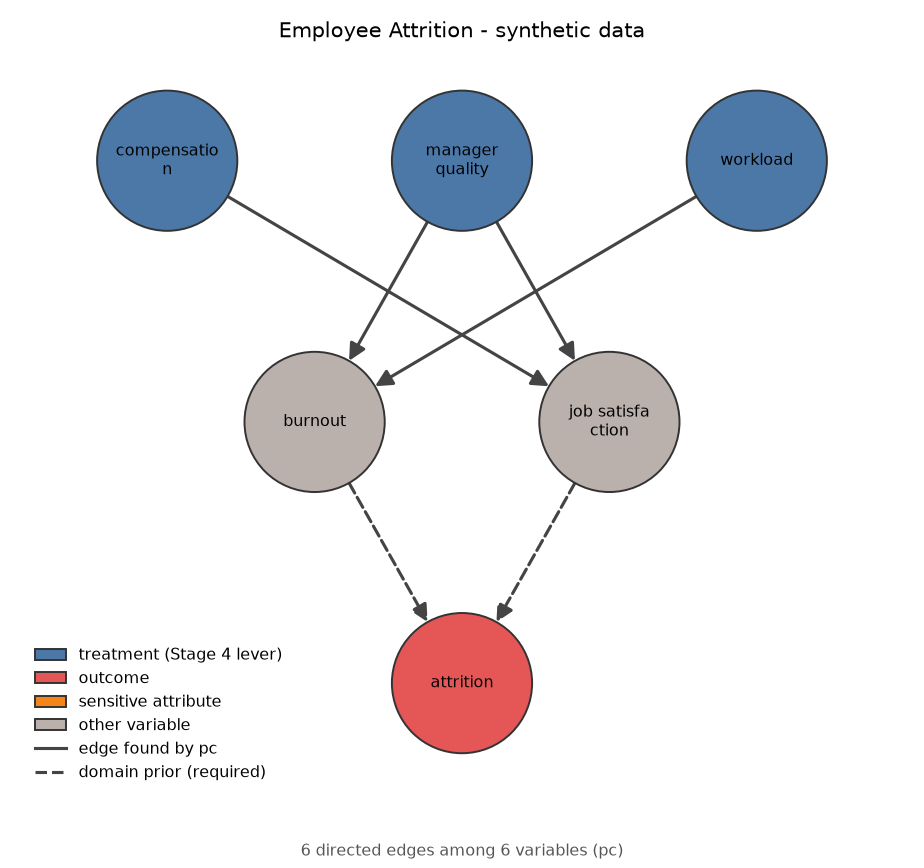

# RootCause

A domain-agnostic **causal decision intelligence** pipeline (the CDIA architecture). Instead of predicting *who* will churn, it asks *why* — learns the causal structure of a domain, estimates how much each lever actually moves the outcome, and ranks interventions by ROI with a fairness check.

The pipeline runs end to end on five domains: a semi-synthetic employee-attrition dataset with a known ground-truth causal graph (so every stage can be checked against the truth), a real randomized workplace-wellness trial paired with a synthetic mirror of it, real German Credit and carclaims data, and Freddie Mac mortgage loans across seven origination years (see Evaluation).

## Pipeline

| # | Stage | What it does | Built with |
|---|-------|--------------|------------|
| 1 | Ingestion | Loads and validates the domain CSV | pandas |
| 2 | Feature store | Writes/materializes causal feature vectors and reads them back through the online-serving path | Feast (parquet offline, SQLite online) |
| 3 | Causal discovery | Learns the DAG with PC, GES or LiNGAM, seeded with required/forbidden domain-prior edges; NetworkX plot | causal-learn, lingam, NetworkX |
| 4 | Effect estimation | ATE per treatment with a permutation-placebo check and an unmeasured-confounder sensitivity analysis | DoWhy, statsmodels |
| 5 | Counterfactuals | "What if satisfaction were high?" via a T-, S-, X-, R- or doubly-robust learner | CausalML |
| 6 | Interventions | Ranks candidate actions by ROI; four-fifths-rule fairness check | fairlearn |
| 7 | Explanation | SHAP attribution plus a plain-language narrative written by the first of three tiers (AutoGen team, single LLM call, template) whose text passes a grounding check | SHAP, AutoGen, OpenAI |

Each stage is a pure function in `causal_engine/pipeline/`. They can run directly, or behind a **CrewAI hierarchical crew** (`causal_engine/agents/crew.py`): 7 specialized agents plus a manager LLM that delegates one stage to each.

### What it finds on the bundled dataset

On the 2,000-row synthetic data (`data/employee_attrition/`, seed 42) the pipeline recovers all 6 ground-truth edges with no spurious ones, and the three levers get correctly-signed effects:

| Lever | ATE on attrition |
|-------|------------------|
| manager_quality | −0.135 |
| compensation | −0.129 |
| workload | +0.119 |

Ranked interventions: manager training, then workload rebalancing, then compensation adjustment. The fairness check on `gender` passes for all three, as designed: the synthetic data deliberately does not wire gender into any structural equation.

> These numbers come from synthetic data with a known answer, which is the point — real observational data has no ground truth to validate a causal claim against.

### Evaluation

```bash
.venv/Scripts/python.exe -m causal_engine.evaluation --replicates 10
```

Runs Stages 1–6 on every dataset in every domain config and writes `docs/evaluation/results.md` and `results.json`. Where the data comes from a known structural causal model (`causal_engine/evaluation/scms.py`) it scores against ground truth, including a **true ATE computed by simulating `do()` on that model**, not just its direct coefficients. `--replicates K` also re-runs on K fresh draws, since one draw is an anecdote. Real data has no model to redraw from, so there K means K bootstrap resamples of the file, which measure stability rather than accuracy. The report also has a Stage 6 fairness section: the sample's four-fifths verdict against the simulated population's true ratio.

Over 10 fresh 2,000-row draws of the attrition model (mean ± sd):

| Measure | Result |
|---------|--------|
| Edge precision / recall | 0.97 ± 0.11 / 0.93 ± 0.14 |
| Edge recall excluding the 2 edges given as domain priors | 0.90 ± 0.21 |
| Draws with the exact graph (SHD 0) | 8 of 10 |
| ATE mean absolute error (true effects are about ±0.12–0.14) | 0.007 ± 0.003 |
| Top-ranked intervention is the true best by true ROI | 10 of 10 |

The committed seed-42 dataset is one of the draws where every edge is recovered; in the other two, edges went missing (and in one, some came back reversed). Stage 3 drops any edge PC leaves unoriented, so this is the stage to harden next.

### Real randomized trial: Illinois Workplace Wellness

```bash
.venv/Scripts/python.exe -m causal_engine.evaluation --domain illinois_wellness --replicates 10
```

Synthetic data can only show the pipeline recovers effects that someone wrote into a simulation. The `illinois_wellness` domain adds a real randomized experiment ([Jones, Molitor & Reif 2019](https://github.com/reifjulian/illinois-wellness-data), CC0 public data; 4,834 enrolled employees, 3,300 offered a workplace wellness program and 1,534 not) whose published result is a **null**: the program did not change employment outcomes. Asked whether the program changed termination by January 2019, the pipeline should therefore find nothing. Only variables measured before assignment are used, and no edge from the program to termination is asserted as a prior.

| | Result |
|---|---|
| Trial: terminated, treated − control (difference in means, 95% CI) | +0.0022 [−0.0222, +0.0265] |
| Pipeline Stage 4 estimate, adjusted for pre-treatment covariates | +0.0020, inside the trial's interval |
| Pipeline placebo test | **failed** (p = 0.89), which here is the correct answer: no evidence of an effect |
| Stage 5 T-learner mean effect | +0.0019 |
| Effect by sex, in the trial (treated − control) | women −0.033 [−0.067, +0.000], men +0.050 [+0.015, +0.085]; difference +0.083, p = 0.0008 (Bonferroni over 4 variables: 0.003) |
| Stage 5 by sex | women −0.031, men +0.046: it reproduces the trial's subgroup estimates |
| Stage 3 edge from the program to termination | not found |
| Outcome missing, treated / control | 0% / 0% (the outcome is fully observed, so dropping rows with no outcome biases nothing) |

An interval of ±0.024 cannot rule out an effect of a couple of percentage points, so this shows the pipeline does not invent an *average* effect, not that the program does nothing. The average null also hides a difference by sex: in this file the program is associated with fewer terminations among women and more among men, and Stage 5 finds the same split. That is exploratory (four variables were picked for this analysis, not pre-specified) and it does not show the program causes harm; the other three splits (two age bands, race) show no difference. The real data has no known graph, so Stage 3 cannot be scored there.

To score Stages 3 and 4 against a known truth on the same schema there is a **synthetic mirror** (`data/illinois_wellness/wellness_synthetic.csv`): the same columns with roughly the real marginals, treatment randomized, and a *planted* effect (about −4.75 points on a 20% base rate). It is a simulation, not evidence about the real program. Over 10 fresh 4,834-row draws:

| Measure | Result |
|---------|--------|
| ATE (true −0.0475) | −0.0475 ± 0.0100 across draws |
| Placebo test passes on the planted effect | 10 of 10 |
| Edge precision / recall | 0.94 ± 0.08 / 0.77 ± 0.06 |

The edge from age band 50+ to `white` is missed in all 10 draws, and the 50+ band's effect on termination in 8 of 10. Both are weak signals. Stage 5's subgroup effects are unbiased here (within 0.01 of the true value on average) but noisy: the sd across draws is 0.011–0.026, about the size of the true differences between subgroups (the mirror's real heterogeneity is small, −0.035 to −0.059), so it cannot resolve them. The domain has one lever and so one candidate intervention: the ranking metrics are left blank rather than reported as a trivial 1/1. Its cost, $152 per person assigned to treatment, is the paper's first-year variable cost (footnote 27: $271 per participant × 0.56 who completed screening), which the authors call conservative because it leaves out paid time off and fixed management costs.

### Real credit data: German Credit

```bash
.venv/Scripts/python.exe -m causal_engine.evaluation --domain german_credit --replicates 10
```

The `german_credit` domain uses the Statlog German Credit data (1,000 loan applicants, 300 defaults; see `data/german_credit/README.md`) and is where Stage 6's fairness check has something to say. It is **observational**: nobody was randomized to a loan term, the outcome exists only for granted loans, and there is no ground truth. So the real-data numbers below are stability checks, not validated effects. The three levers are loan duration, credit amount and installment rate; each is adjusted for every other applicant column (41 encoded features, exercising the categorical-encoding stage on a real, mostly nominal dataset).

**Real data, 10 bootstrap resamples of the 1,000 applicants** (mean ± sd; effects are per month, per 1,000 DM, per installment-rate point):

| Lever | Full-sample effect on P(default) | Bootstrap | Same sign | Placebo passed |
|---|---|---|---|---|
| duration_months | +0.0047 | +0.0046 ± 0.0018 | 10/10 | 9/10 |
| credit_amount_kdm | +0.0159 | +0.0143 ± 0.0098 | 9/10 | 6/10 |
| installment_rate | +0.0426 | +0.0388 ± 0.0216 | 10/10 | 7/10 |

The signs are stable (longer, bigger and heavier loans go with more default) but only the duration effect reliably stands out from a permutation placebo; the credit-amount and installment estimates are within noise in a third to 40% of resamples. The rank-1 intervention is `lower_installment_burden` in 6 of 10 resamples and `shorten_loan_term` in 4, so the ranking is not settled. Its costs are illustrative round numbers, not from the data. The placebo cannot see unmeasured confounding (income, the loan officer's judgement), so none of this says lowering a lever would cut default.

**Fairness check.** The sensitive attribute is age under 25 (149 applicants): default rate 40.9% against 28.1% for everyone else, a ratio of 0.686 against the four-fifths threshold of 0.8, so the check **flags**. It is flagged in 9 of 10 resamples (ratio 0.705 ± 0.094): with 149 young applicants the ratio is noisy enough that a resample can land above 0.8. This is a descriptive statement about outcome rates in the population, not evidence of discrimination or of how any intervention would treat the two groups differently. Two other attributes on this data: sex (`female`, from the coded personal-status column) gives 0.79, borderline, and foreign-worker status gives 0.35 on only 37 non-foreign applicants, which is too few to trust.

**Semi-synthetic version** (`credit_semi_synthetic.csv`): the same real applicants, with only `default` re-simulated. The lever effects are planted (0.03 / 0.10 / 0.30 on the logit), and the `young` term is solved so the simulation reproduces the real 40.9% / 28.1% default rates. The levers keep their real correlations with the other columns, so the method has to adjust to recover them. Because the outcome is simulated this validates the method on realistic covariates; it says nothing about what causes default. Over 10 fresh 1,000-row draws:

| Measure | Result |
|---|---|
| True effects (per unit) | duration +0.0049, credit amount +0.0163, installment rate +0.0493 |
| Estimated | +0.0048 ± 0.0016, +0.0220 ± 0.0103, +0.0489 ± 0.0093 |
| ATE mean absolute error | 0.006 ± 0.003 |
| Top-ranked intervention is the true best | 10 of 10 (Kendall τ 0.80 ± 0.32: the 2nd and 3rd places swap in some draws) |
| Fairness verdict matches the population's | 10 of 10 (true ratio 0.690; Stage 6 ratio 0.665 ± 0.066) |
| Stage 3 graph | not scored: the graph among real covariates is unknown |

Duration and installment rate are recovered without visible bias. The credit-amount estimate is the weak one: its sd across draws (0.010) is about two thirds of its true effect, and its mean sits 0.006 high (about 1.8 standard errors, so not clearly a bias). I have not isolated why; its heavy right tail and its 0.63 correlation with duration are the obvious candidates. The fairness verdict is 10 of 10 partly because the planted ratio (0.69) is far from the threshold; a ratio near 0.8 would be much less stable at this sample size, and that case is not tested here.

### Real insurance data: carclaims

```bash
.venv/Scripts/python.exe -m causal_engine.evaluation --domain carclaims --replicates 10
```

The `carclaims` domain uses a vendor sample of 15,420 vehicle-insurance claims from 1994-96 (923 with fraud found, 6.0%; see `data/carclaims/README.md`). Its provenance cannot be verified beyond the file's long use in the fraud-detection literature. It is **observational with no ground truth and no synthetic twin**, so like German Credit's real half the numbers below are stability checks, not validated effects, and the outcome is fraud *found*, which depends on investigation as well as on fraud. The three levers are a police report being on file, an internal sales agent and the deductible, each adjusted for every other claim column (33 encoded features, so 32 adjustment columns per lever). A full pipeline run takes about 2.5 minutes (15k rows, 32 adjustment columns), so the bootstrap is the slow part.

**10 bootstrap resamples of the 15,420 claims** (effects are on P(fraud found); per $100 for the deductible):

| Lever | Full-sample effect | Bootstrap | Same sign | Placebo passed |
|---|---|---|---|---|
| police_report_filed (428 claims) | −0.0248 | −0.0225 ± 0.0094 | 10/10 | 7/10 |
| agent_internal (241 claims) | −0.0099 | −0.0103 ± 0.0084 | 9/10 | 0/10 |
| deductible_100usd | +0.0092 | +0.0095 ± 0.0033 | 10/10 | 6/10 |

None of the three is a result. The signs are mostly stable, but the internal-agent effect never stands out from a permutation placebo, and the other two do in only 6 to 7 of 10 resamples. The levers are also rare (2.8% of claims have a police report, 1.6% an internal agent, 3.8% a non-$400 deductible), which is why the estimates are noisy. Reading them as causal effects fails for reasons the placebo cannot see: a police report is more likely on a genuine claim, so "claims with a report show less fraud found" does not say that requiring one would reduce fraud; and the deductible is not monotone in the data (fraud found is 5.8% at $400 and at $700 but 17.9% at $500, 263 claims), so a linear slope of +0.009 per $100 summarizes a bump, not a dose-response. The rank-1 intervention is `require_police_report` in 9 of 10 resamples, but its cost ($50 per claim, like the other two) is an illustrative number fixed before seeing the results.

**Fairness check.** The sensitive attribute is sex (2,420 female claims): fraud found on 4.3% against 6.3% for male policyholders, a ratio of 0.69 against the 0.8 threshold, so the check **flags**, in 8 of 10 resamples (0.743 ± 0.075). Female policyholders hold more liability-only policies (39% against 31%), where fraud is almost never found (0.7%), so part of the gap is policy mix. The flag says found-fraud rates differ by group, not that anyone was treated unfairly.

### Real mortgage data: Freddie Mac

```bash
.venv/Scripts/python.exe scripts/prepare_freddie_mac.py     # raw samples -> one row per loan, about 20 s
.venv/Scripts/python.exe -m causal_engine.evaluation --domain freddie_mac --replicates 10 --out docs/evaluation/freddie_mac
```

The `freddie_mac` domain uses Freddie Mac's Single-Family Loan-Level Dataset, in its published 50,000-loan random samples of fixed-rate loans, for seven origination years: 2007, 2008, 2010 and 2011 (the main table below) and 2016, 2019 and 2022 (recent vintages and a pandemic stress case, after the table). The data are a registered download, so **nothing from them is committed** (`data/freddie_mac/*` is gitignored; see `data/freddie_mac/README.md` for how to get and prepare them, and for where the files differ from the user guide). The outcome is serious delinquency within 36 months: ever 90+ days late, REO, short sale or charge-off. The three levers are the interest rate, the loan-to-value ratio and the debt-to-income ratio, each adjusted for the other 24 encoded loan columns (credit score, loan size and term, mortgage insurance, purpose, occupancy, channel, property type, origination quarter and so on).

Choices that matter, all made in `scripts/prepare_freddie_mac.py`:

- **One dataset kind per vintage (`real_2007` ... `real_2011`), never pooled.** 2007-08 are crisis-era loans and 2010-11 a calm, refinance-heavy period, so pooling would make the vintage a confounder of every lever.
- **Loans that left before month 36 without defaulting are excluded, not counted as good.** That removes 33-49% of each sample (almost all prepaid or refinanced), so the default rates below describe loans that *stayed*, not lifetime default probabilities, and the survivors are a selected group.
- **DTI is not disclosed for relief-refinance loans** (about a third of the kept 2010-11 loans). It is filled with the vintage median and flagged in `dti_missing`, so the DTI effect comes from the loans that report it.

| Vintage | Loans | Serious delinquency | Interest rate, per +1 point (bootstrap sd) | LTV, per point | DTI, per point | Rank-1 intervention (of 10 resamples) | First-time-buyer ratio (flagged) |
|---|---|---|---|---|---|---|---|
| 2007 | 31,780 | 15.5% | +0.117 (0.006) | +0.0009 | +0.0018 | lower rate, 10 | 0.93 (0/10) |
| 2008 | 25,531 | 11.8% | +0.099 (0.003) | +0.0006 | +0.0015 | lower rate, 10 | 0.97 (0/10) |
| 2010 | 30,466 | 2.2% | +0.028 (0.003) | +0.0004 | -0.0001, **placebo passed 3/10** | lower rate 6, cap LTV 4 | 0.63 (10/10) |
| 2011 | 33,210 | 1.6% | +0.010 (0.002) | +0.0004 | -0.0000, **placebo passed 0/10** | cap LTV, 10 | 0.88 (2/10) |

Effects are changes in the probability of serious delinquency. Full tables: `docs/evaluation/freddie_mac/results.md`. One pipeline run on about 30,000 loans takes about 65 seconds.

**How to read it, honestly:**

- **The signs are stable and the sizes are not comparable across years.** A higher rate, a higher LTV and a higher DTI all go with more delinquency in the crisis vintages, and the rate and LTV estimates keep their sign in all 10 resamples in every vintage (DTI in 2010-11, where it is indistinguishable from zero, keeps it in 9 of 10). The interest-rate estimate shrinks from +0.117 to +0.010 as the base rate falls from 15.5% to 1.6%. Resampling changes the estimates very little (sds of 0.002-0.006), but that measures stability, not accuracy: every resample shares the same confounding.
- **These are associations, not effects of setting a rate.** Lenders set the rate from the borrower's risk, and this file does not record the pricing adjustments, points or underwriter judgement behind it. A 1-point higher rate going with 11.7 points more delinquency in 2007 is far too large to be the effect of the payment itself; it is mostly risk that the other columns do not capture. The placebo test and the sensitivity analysis cannot see that (the sensitivity robustness values for the rate are 0.11, 0.13, 0.05 and 0.02 for 2007, 2008, 2010 and 2011: the 2011 estimate would be explained away by a very weak confounder, and, as the sensitivity section shows, that measure cannot detect confounding in the first place).
- **The intervention ranking follows from those numbers and from made-up costs.** "Lower the interest rate" comes first in three vintages because its estimate is the largest and the most confounded one. It is a check that the pipeline runs and ranks consistently, not lending advice.
- **DTI in 2010-11 shows no effect beyond noise** (placebo passes in 3 and 0 of 10 resamples): the outcome is rare (about 2%) and a third of the loans have an imputed DTI.
- **The fairness flag is not a fair-lending finding.** First-time-buyer status is not a protected class (this file has no race, sex or age), and in 2010 first-time buyers default *less* (1.5% against 2.3%), which is what the 0.68 ratio flags. Read it as "default rates differ between the two groups".
- Each year is one 50,000-loan sample of loans Freddie Mac bought, not all US mortgages.

**Recent vintages and a pandemic stress case (2016, 2019, 2022).** Three more samples, each run under two outcomes (`real_2016`, `real_2016_relief_adjusted`, and the same for 2019 and 2022):

```bash
.venv/Scripts/python.exe scripts/prepare_freddie_mac.py 2016 2019 2022                    # 90+ day outcome
.venv/Scripts/python.exe scripts/prepare_freddie_mac.py --relief-adjusted 2016 2019 2022  # relief-adjusted outcome
.venv/Scripts/python.exe -m causal_engine.evaluation --domain freddie_mac --dataset real_2019 --dataset real_2019_relief_adjusted --replicates 10 --out docs/evaluation/freddie_mac_recent   # about 80 minutes for all six
```

- **Why 2022 is the newest year.** The data end 2026-03-31 and the outcome needs 36 months of loan age, so only loans originated through about early 2023 can be labelled. 2023 is only partly observable and 2024-2026 not at all; a shorter horizon would be a different outcome. Loan age does not advance for every month a delinquent loan misses, so 24 non-defaulted 2022 loans were still active with age under 36 and are dropped and counted (a loan that had already defaulted keeps its known outcome).
- **The 90+ day outcome stops meaning "default" in 2020-21.** In the 2019 sample 92% of the loans that went 90+ days late carried a relief flag (a disaster flag, a payment deferral or a forbearance-type assistance plan) at or before that month, 97% were later current again and 0.5% were ever liquidated or REO. In 2007 47% were liquidated. The **relief-adjusted** outcome removes from the defaults the loans that were relief-flagged at or before their first 90+ day month and never liquidated (they stay in the sample as non-defaults). It is a heuristic: relief was not randomly assigned, some relieved loans were genuinely troubled, and the flag is information from after origination.

| Vintage | Loans | 90+ day rate | Relief-adjusted rate | Relief-flagged | Later current again | Ever liquidated or REO |
|---|---|---|---|---|---|---|
| 2007 | 31,780 | 15.5% | 15.1% | 2.7% | 53.7% | 47.2% |
| 2008 | 25,531 | 11.8% | 11.5% | 2.4% | 54.0% | 39.9% |
| 2010 | 30,466 | 2.2% | 2.1% | 5.4% | 48.0% | 38.0% |
| 2011 | 33,210 | 1.6% | 1.5% | 8.2% | 53.5% | 34.0% |
| 2016 | 40,139 | 1.4% | 0.7% | 50.2% | 82.0% | 5.3% |
| **2019** | 19,654 | **12.6%** | **1.0%** | **92.4%** | **97.4%** | **0.5%** |
| 2022 | 42,230 | 3.5% | 1.7% | 53.2% | 69.8% | 3.2% |

(The last three columns are shares of each vintage's 90+ day delinquencies. 61% of the 2019 loans left before month 36, mostly in the 2020-21 refinance wave, so its survivors are the most selected sample here.)

| Vintage, outcome | Interest rate, per +1 point (bootstrap sd) | LTV, per point (placebo passed) | DTI, per point (placebo passed) | Rank-1 intervention (of 10 resamples) | First-time-buyer ratio (flagged) |
|---|---|---|---|---|---|
| 2016, 90+ day | +0.0154 (0.0020) | +0.0001 (8/10) | +0.0001 (3/10) | lower rate, 10 | 0.71 (10/10) |
| 2016, relief-adjusted | +0.0053 (0.0015) | +0.0000 (6/10) | +0.0001 (2/10) | lower rate 7, cap LTV 3 | 0.63 (10/10) |
| 2019, 90+ day | +0.0623 (0.0063) | +0.0007 (10/10) | +0.0025 (10/10) | cap DTI, 10 | 0.84 (1/10) |
| 2019, relief-adjusted | +0.0090 (0.0018) | -0.0000 (4/10) | -0.0000 (0/10) | lower rate, 10 | 0.70 (9/10) |
| 2022, 90+ day | +0.0088 (0.0018) | +0.0002 (8/10) | +0.0003 (9/10) | cap DTI 8, cap LTV 2 | 0.83 (2/10) |
| 2022, relief-adjusted | +0.0040 (0.0014) | +0.0000 (3/10) | +0.0001 (3/10) | cap DTI 5, lower rate 4, cap LTV 1 | 0.87 (0/10) |

Effects are changes in the probability of the outcome. Full tables: `docs/evaluation/freddie_mac_recent/results.md`.

**How to read it, honestly:**

- **The conclusions depend on how the outcome is defined, and the pipeline cannot tell you that.** In 2019 the interest-rate estimate is 7 times smaller under the relief-adjusted outcome (+0.062 to +0.009), the LTV and DTI effects go from placebo-passing in 10 of 10 resamples to indistinguishable from zero, the top-ranked intervention flips from "cap DTI" (10 of 10) to "lower the interest rate" (10 of 10), and the first-time-buyer verdict flips from rarely flagged (1 of 10) to mostly flagged (9 of 10). A plausible reason (not tested here) is that under the 90+ day outcome the pipeline is partly measuring who took up forbearance, not who failed to pay. The fix is in data preparation, not in a pipeline stage: Stage 4 never sees the relief flags.
- **This is a sensitivity result, not proof that the pipeline "handles" a pandemic.** The relief-adjusted 2019 outcome has only 194 events in 19,654 loans, so its LTV and DTI estimates are noisy (the sign matches the full sample in 8 of 10 resamples) and I would not read anything into their size. The adjusted outcome is better than the 90+ day one for 2019, not a verified loss definition.
- **2016 and 2022 are affected less but not trivially.** About half of their 90+ day delinquencies are relief-flagged, the rate estimate shrinks 2-3 times under the adjusted outcome (+0.0154 to +0.0053, +0.0088 to +0.0040), and the 2022 ranking becomes unstable (5, 4 and 1 of 10 across three interventions). The four older vintages are barely affected (2-8% relief-flagged), so their results above stand.
- **The discovered graphs agree with that (descriptive only).** On the 2019 90+ day data the PC graph has six variables pointing at the outcome (credit score, loan size, LTV, DTI, mortgage insurance and the rate); on the relief-adjusted data it has two (credit score and the rate). Figures: `docs/figures/freddie_mac_real_2019_pc.png` and `docs/figures/freddie_mac_real_2019_relief_adjusted_pc.png` (and 2016, 2022). There is no true graph to compare them with, and in the figures a long edge can pass behind a node.
- **All of these remain confounded associations.** There is no ground truth for the real vintages (see the twin below for the one place there is), lenders set the rate from risk, and the placebo test and the sensitivity analysis cannot see that. The vintages are never pooled and their effect sizes are not comparable.

**Data source and terms.** Freddie Mac's Single-Family Loan-Level Dataset, used under its dataset and website terms: analysis for personal or internal purposes, and noncommercial research results that cannot be used to recreate the data or identify anyone. This repository publishes only aggregates (the tables above, figures, code), no loan-level rows and no real loan identifiers, and is not affiliated with or endorsed by Freddie Mac. Details in `data/freddie_mac/README.md`.

**Semi-synthetic twin, scored against a known answer.** `causal_engine/configs/freddie_mac.yaml` has a further dataset kind, `semi_synthetic`: the real 2007 loans' covariates with a *simulated* default, whose lever effects are planted (`causal_engine/evaluation/scms.py::freddie_mac_semi_synthetic_scm`, built by `scripts/generate_semi_synthetic_freddie_mac_data.py`, same idea as the German Credit twin). It keeps the real correlation between the rate and the borrower's credit score, but unlike the real data, here every driver of default *is* a recorded column, so there is no unmeasured confounding — this validates the method, not what actually causes default.

```bash
.venv/Scripts/python.exe scripts/generate_semi_synthetic_freddie_mac_data.py
.venv/Scripts/python.exe -m causal_engine.evaluation --domain freddie_mac --dataset semi_synthetic --replicates 10 --out docs/evaluation/freddie_mac
```

| Treatment | True ATE (+1 shift) | Estimated ATE (10 replicates) | Bias |
|---|---|---|---|
| interest_rate | +0.1380 | +0.1201 ± 0.0063 | -0.0180 |
| ltv | +0.0012 | +0.0007 ± 0.0001 | -0.0005 |
| dti | +0.0019 | +0.0017 ± 0.0002 | -0.0002 |

Placebo passes 10/10, the fairness verdict matches the true one 10/10 (ratio 0.880 estimated vs 0.876 true), and the pipeline's top-ranked intervention (lower the interest rate) matches the true ROI ranking in all 10 replicates. Full table: `docs/evaluation/freddie_mac/twin_results.md`. **Read this as: when the pipeline's assumptions hold (no unmeasured confounding), it recovers the planted effects to within about 13% for the rate and comes in low for LTV and DTI, whose true effects are tiny; it does not mean the real 2007-11 estimates above are unconfounded.**

### Stress tests

```bash
.venv/Scripts/python.exe -m causal_engine.evaluation --stress
```

The baseline data is easy (linear, independent root causes, no confounding), so scoring well on it proves little. `--stress` changes **one** thing at a time, runs 10 draws of each on the same seeds, and scores against the true effects simulated from that variant's model. Results are in `docs/evaluation/stress.md`.

| What changed | What happened |
|---|---|
| Fewer rows (1000 / 500 / 250) | Estimates stay unbiased but noisier (compensation SD 0.012 at 2000 rows, 0.032 at 250). The intervention ranking gets shakier: a wrong first pick in 3 of 30 draws, costing up to 34% of the best option's ROI. Graph recovery was already imperfect at 2000 rows and 10 draws is too few to say it got worse. |
| **Hidden confounder** (seniority raises pay and lowers attrition, not in the data) | Compensation's effect is overstated by 0.035 / 0.074 / 0.106 at confounder strength 0.3 / 0.6 / 0.85, which is 31% / 67% / 98% of the true effect. The SD across draws is 0.009, so more data would not fix it. **The permutation placebo still passes in 10 of 10 draws**, Stage 3 draws a spurious compensation→attrition edge (10 of 10 at 0.6 and 0.85), and at 0.85 the inflated pay estimate swaps the 2nd and 3rd ranked interventions (τ 0.67). The top pick stays right. The other two treatments are unaffected. |
| Same confounder, measured and declared in the config | Bias +0.003 ± 0.013: adjustment works when the column exists. PC never orients seniority—compensation (the two directions are Markov-equivalent, still undirected at 200,000 rows), so Stage 3 drops that edge. |
| Curved but monotone mechanisms | Mild: compensation off by 0.012 (11%), the rest near 0. The top pick is right in only 6 of 10 draws, but the top two interventions' true ROI differ by 2%, so the cost is 0.9% of ROI. That is a near-tie, not a failure. |
| **U-shaped** workload → burnout | The pipeline reports workload's effect as −0.002 where the truth is +0.082. PC finds workload→burnout in 1 of 10 draws. The placebo fails on workload, which reads correctly as "no evidence of an effect" and is the wrong conclusion. |

What to take from this: the pipeline's own checks cannot see a hidden confounder (the refuter only tests that an estimate stands out from noise), and a linear view can miss a real effect entirely. The magnitudes depend on the strengths and shapes chosen here; the direction and mechanism are the finding. The next section compares it with plain regression and SHAP on the same data.


### Against naive baselines

```bash
.venv/Scripts/python.exe -m causal_engine.evaluation --baselines
```

Add `--workers 8` (to this or `--stress`) to run scenarios in parallel; results are identical and the full run takes about 80 seconds instead of ~10 minutes.

"Isn't this just feature importance?" Same scenarios, same 10 draws, same true effects, but each draw is also analysed by three shortcuts: a regression of attrition on **every** column, a regression on the treatment alone, and a **SHAP** ranking (gradient-boosted model, mean |SHAP| of the variable each intervention moves, divided by cost). Results are in `docs/evaluation/baselines.md`.

| Method | On the unmodified data (10 draws) | Where it breaks |
|---|---|---|
| RootCause pipeline | Bias within ±0.003 of the true ATE, all 30 signs right, right first pick 10/10 | Hidden confounder (bias −0.074 on compensation at strength 0.6) and the U-shape, as above |
| Regression on all columns | Estimates ≈ 0 for every lever (bias +0.117 on compensation, whose true effect is −0.124), signs right only 17/30, right first pick 3/10, ROI regret 37% | Everywhere. Pay, manager quality and workload act on attrition *through* satisfaction and burnout, so controlling for those two removes the effect being measured |
| Regression on the treatment alone | Identical to the pipeline: no confounder, so they are the same regression | Observed confounder: bias −0.074 where the pipeline's is +0.003. Hidden confounder: same error as the pipeline |
| SHAP importance ÷ cost | Ranks satisfaction and burnout (the mediators) top in 10/10 draws, never a lever. Right first pick 6/10, ROI regret 14% | Hidden confounder: 1/10 right at strength 0.6 and 0/10 at 0.85, because the confounder's importance leaks onto compensation. U-shaped workload: regret 58% |

Three things to be straight about. The pipeline's adjustment set is **declared in the config, not learned**, so where there is no confounder an analyst with the same causal knowledge does exactly as well by regressing the treatment alone: what the pipeline adds there is encoding that knowledge, the graph, the refutation test and the ranking, not a better estimator. It beats the simple regression only where an *observed* confounder has to be adjusted for. It does nothing for a hidden one. And SHAP is not always worse: on the monotone-curvature data it picks the right intervention 7/10 times with 0.7% regret against the pipeline's 6/10 and 0.9%, a near-tie; and at n=250 it gets 7/10 against the pipeline's 9/10. As before, the magnitudes depend on the simulation's effect sizes; the pattern is the finding.

### Sensitivity analysis (Stage 4)

```bash
.venv/Scripts/python.exe -m causal_engine.evaluation --sensitivity
```

The permutation placebo cannot see an unmeasured confounder, so each linear-regression estimate now also carries a **sensitivity analysis** (Cinelli & Hazlett 2020, `causal_engine/pipeline/sensitivity.py`): the *robustness value* is the share of residual variance a hidden confounder would have to explain, in both the treatment and the outcome, to cut the estimate to zero (and a second value for losing significance), plus a benchmark that bounds the estimate if an unobserved confounder were as strong as the strongest observed covariate. The formulas match the authors' `sensemakr` package (exactly for the robustness values; the benchmark bounds to about three decimals).

It quantifies "what if?"; it does **not** detect confounding, and the check on data with a known hidden confounder shows it can mislead. Compensation's effect with a hidden `seniority` confounder (10 draws, n = 2,000; true effect from `do()`):

| corr(seniority, pay) | True effect | Naive estimate | Robustness value | Confounder's true R² (pay / attrition) | Corrected at the true strength |
|---|---|---|---|---|---|
| 0.00 | −0.116 | −0.114 ± 0.010 | 0.21 | 0.002 / 0.074 | −0.116 |
| 0.30 | −0.113 | −0.148 ± 0.009 | 0.26 | 0.077 / 0.068 | −0.112 |
| 0.60 | −0.110 | −0.183 ± 0.009 | 0.32 | 0.338 / 0.051 | −0.107 |
| 0.85 | −0.108 | −0.214 ± 0.009 | 0.37 | 0.709 / 0.025 | −0.101 |

Two things to take from it. The omitted-variable-bias formula is exact given the confounder's true strength (it recovers the adjusted estimate to floating point), which is what makes the tool sound. But the robustness value goes **up** as the confounding grows: the more the hidden confounder inflates the estimate, the larger and more precise it looks, so the *more* robust it appears (0.21 → 0.37 while the bias goes from 0 to 98% of the true effect). A high robustness value is a statement about erasing the effect entirely, not reassurance that it is unbiased. An analyst does not know the confounder's real strength; the benchmark against observed covariates is the only handle, and it is only as good as the assumption that the hidden cause resembles the observed ones.

### Counterfactual learners (Stage 5)

```bash
.venv/Scripts/python.exe -m causal_engine.evaluation --learners
```

`counterfactuals.meta_learner` now selects **T, S, X, R or doubly-robust (DR)** learners (before, the key was read but ignored and every run was a T-learner; an unknown value now raises). `base_learner` is `linear` or `gbm`; the X/R/DR learners use a propensity score, `estimated` by default or `constant` for a randomized trial (Illinois), clipped to [0.01, 0.99] with the share of units outside [0.05, 0.95] reported as an overlap warning. The comparison runs on the Illinois wellness trial, where the one heterogeneity with evidence behind it is a sex reversal (trial: women −0.033, men +0.050, average +0.002 with a 95% interval of ±0.024):

| Learner (linear base) | Women | Men | Sex reversal seen in 10 bootstrap resamples |
|---|---|---|---|
| T | −0.031 | +0.046 | 10/10 |
| X | −0.031 | +0.046 | 10/10 |
| R | −0.032 | +0.047 | 10/10 |
| DR | −0.031 | +0.046 | 10/10 |
| **S** | **+0.002** | **+0.002** | **0/10** |

The linear S-learner gives one coefficient for the treatment, so it reports the same effect for everyone (per-person sd exactly 0) and cannot see who is helped and who is harmed. With gradient boosting it sees the pattern in 8–10 of 10 resamples but shrinks it (S: −0.011 / +0.022). All learners put the average inside the trial's interval. **The simulated mirror cannot rank them on heterogeneity**: its planted effect is a constant on the logit scale, so the true subgroup effects are almost equal and the learner that reports one number for everyone scores best there; mirror bias and subgroup error mostly measure noise. The R-learner takes seconds where the others take a fraction of a second (cross-fitting). Full tables are in `docs/evaluation/learners.md`.

### Causal discovery algorithms (Stage 3)

```bash
.venv/Scripts/python.exe -m causal_engine.evaluation --stress --workers 4 --algorithm ges     # or lingam
```

`causal_discovery.algorithm` is `pc` (default), `ges` or `lingam` (an unknown name used to run PC silently and label it as requested; it now raises). GES has no background-knowledge input, so domain priors are applied after the search (forbidden edges removed, an undirected edge oriented when the priors forbid exactly one direction); LiNGAM receives forbidden edges as "no directed path" prior knowledge. Same draws and seeds as the stress tests, 10 draws each (edge precision / recall, SHD):

| Scenario | PC | GES | LiNGAM |
|---|---|---|---|
| baseline (n = 2,000) | 0.97 / 0.93, SHD 0.5 | 0.96 / 0.95, 0.6 | 0.51 / 0.92, 5.3 |
| n = 500 | 0.90 / 0.83, 1.0 | 0.74 / 0.88, 2.3 | 0.60 / 0.95, 4.0 |
| n = 250 | 0.94 / 0.90, 0.7 | 0.80 / 0.92, 1.8 | 0.58 / 0.90, 4.3 |
| curved (monotone) mechanisms | 0.97 / 0.93, 0.5 | 0.77 / 0.87, 2.3 | 0.70 / 0.83, 2.2 |
| non-Gaussian (uniform) noise | 0.95 / 0.93, 0.4 | 0.89 / 0.97, 1.0 | 0.62 / 1.00, 4.1 |
| uniform noise, continuous variables only | 1.00 / 1.00, 0.0 | 0.98 / 1.00, 0.1 | **1.00 / 1.00, 0.0** |
| Illinois mirror (mixed types) | 0.94 / 0.77, 3.3 | 0.60 / 0.29, 10.3 | 0.73 / 0.64, 5.7 |

PC stays the default. GES matches it on the easy baseline but loses ground at small samples, on curved mechanisms and on mixed binary/zero-inflated data. I have not isolated why; two candidates are its Gaussian BIC score and that its priors arrive after the search instead of guiding it. LiNGAM is the instructive one: it is perfect exactly where its assumptions hold (linear, non-Gaussian noise, continuous variables), and poor everywhere else. Gaussian noise leaves directions unidentified, and every domain here has a **binary outcome**, which violates linearity, so on the full variable set roughly half the edges it reports are wrong (precision 0.51 on the baseline). The effect estimates and intervention ranking are identical across the three, since Stage 4 takes its adjustment set from the config, not from this graph.

### Causal graph plots

```bash
.venv/Scripts/python.exe scripts/plot_causal_graphs.py --dot      # every domain -> docs/figures/
```

`causal_engine/utils/graph_plot.py` draws the Stage 3 graph as a layered DAG with NetworkX and matplotlib (no Graphviz binary needed): causes read top to bottom, treatments are blue, the outcome red, the sensitive attribute orange, dashed edges are domain priors (asserted, not discovered), and variables with no edges are listed under the figure. `to_dot` writes the same graph as Graphviz DOT, and `GET /jobs/{id}/graph` serves a finished job's graph (`?format=dot` for DOT).



### Causal anomaly flagging

```bash
.venv/Scripts/python.exe -m causal_engine.evaluation --anomalies          # simulated data, known graph
.venv/Scripts/python.exe -m causal_engine.evaluation --anomalies-real     # real carclaims / German Credit / Freddie Mac 2007 covariates
.venv/Scripts/python.exe scripts/flag_anomalies.py --domain carclaims # top records on real data
```

`causal_engine/pipeline/anomalies.py` fits each variable's mechanism given its parents in the discovered graph and scores every record by how surprising its values are *given their causes* (centred negative log-likelihood, summed), naming the variable that breaks its mechanism most. The mechanism follows the variable's **type**: logistic for a binary variable, **multinomial logistic for a categorical or ordinal one** (a non-binary column with at most 12 distinct values, such as a deductible or an age band), linear-Gaussian for the rest. Variables with no parents in the graph are reported but **not scored** by default (`score_roots=True` includes them). Tested by corrupting 3% of records, either by swapping in another record's value (every value stays ordinary, so no single-variable check can see it) or by pushing it 3 sd away.

**On real data the first version failed, and this is the fix.** It modelled every non-binary column as Gaussian, so on carclaims a 4-level deductible whose mode is one value looked like a continuous variable with a tiny sd: **100% of the 100 top-ranked claims were one deductible level** (a level held by 2% of claims). With type-aware mechanisms and roots not scored, the top of the list is varied, and each row carries the probability its causes gave the observed value (for example a claim flagged as fraud when its causes gave that a 0.1% chance). Measured in `docs/evaluation/anomalies_real.md`:

| carclaims, real covariates (top 100, no injection) | Earlier (Gaussian, roots scored) | Type-aware |
|---|---|---|
| Records whose largest surprise is on the single most common variable | 100% | 40% |
| ... and on that variable's single most common value | 100% | 17% |

It is a large improvement, not a complete fix: a rare level is still surprising **given its causes** (that is the 17%), and German Credit's top 100 still has 24% on one duration (48 months, held by 4.8% of applicants). With faults injected into the real covariates (5 draws; the graph is the one Stage 3 finds on the uncorrupted data):

| carclaims | Detection AUC | Names the corrupted variable |
|---|---|---|
| **Categorical value swapped: type-aware** | 0.78 | 0.74 |
| Categorical value swapped: earlier (Gaussian) | 0.70 | 0.52 |
| Mahalanobis / isolation forest | 0.68 / 0.72 | – |
| Binary value swapped: type-aware / earlier / Mahalanobis | 0.81 / 0.76 / 0.79 | 0.77 / 0.71 / – |

Not every measure improved: for categorical swaps the earlier method's top-k precision is higher (0.27 vs 0.18), because a Gaussian model finds a rare level swapped in very easily. On German Credit the two are within noise on detection (AUC 0.51 to 0.64 for every method on swaps; 0.97 vs 0.95 on 3-sd shifts), with better attribution for the type-aware one (binary 0.60 vs 0.44, categorical 0.43 vs 0.23).

On simulated data with a known graph (attrition, continuous variable corrupted, 10 draws):

| Detector | Swap AUC | Shift AUC | Names the right variable (shift) |
|---|---|---|---|
| **causal, true graph** | 0.74 | 1.00 | 100% |
| causal, PC graph | 0.72 | 0.97 | 91% |
| causal, true graph, roots scored | 0.68 | 1.00 | 100% |
| Mahalanobis distance | 0.68 | 1.00 | – |
| isolation forest | 0.56 | 0.90 | – |
| marginal z-score | 0.52 | 0.94 | – |

The honest reading: causal flagging now edges out Mahalanobis on swaps and on binary flips (attrition: 0.74 vs 0.68 and 0.65 vs 0.59), **but part of that edge is by construction**: faults are injected into non-root variables, which are exactly the ones now scored, so leaving the roots out removes noise from variables that were never corrupted. The cost shows in the `root` sections of `docs/evaluation/anomalies.md`: a corrupted root is visible only through its children, so a 3-sd shift in an attrition root scores AUC 0.96 and average precision 0.68 (0.99 and 0.87 with roots scored, matching Mahalanobis), and on the Illinois mirror a swapped root scores 0.52 against 0.56 with roots scored and 0.60 for Mahalanobis. On the Illinois mirror the causal detector is otherwise level with Mahalanobis (0.95 vs 0.93 on shifts). Its lasting contribution is **attribution** (which variable to look at); it clearly beats an isolation forest and single-variable checks. Flipping a **binary** variable to a value that was plausible anyway is nearly invisible to every method. A fault also makes its children look surprising, so the named variable is sometimes a child (the "or one of its children" column counts that). There are no labelled anomalies on any real dataset: nothing here is a claim about finding real fraud or credit anomalies, only about what the detector can see when a fault has a known form. Flagged means "not explained by this model" (a missing cause, a wrong functional form and a data-entry error look the same).

**Freddie Mac 2007 (31,780 loans, 8 variables, 19 edges, faults injected as above, 5 draws).** Continuous variable pushed 3 sd: causal 0.93 AUC vs Mahalanobis 0.89, isolation forest 0.76, marginal z 0.86, and it names the corrupted variable 89% of the time (97% counting its children). Continuous value swapped: 0.58 vs 0.56 / 0.55 / 0.52, i.e. barely above chance for every detector. Binary flipped: causal 0.73, **below** Mahalanobis 0.74 and isolation forest 0.76. The real top-100 has no dominant (variable, value): the most common one is `ltv` = 13 at 4%, a value held by 0.1% of loans. So the attribution advantage holds here, the detection advantage only for large shifts.

### Stage 7 narrative tiers (AutoGen, single call, template)

```bash
.venv/Scripts/python.exe scripts/explain_tiers.py --domain carclaims --repeat 5             # which tier wins, and why others lost
.venv/Scripts/python.exe scripts/explain_tiers.py --domain carclaims --repeat 10 --compare  # each LLM tier on its own
```

Stage 7 tries three writers over the same fact sheet (the effects, refutation results, counterfactual, top recommendation and fairness result from Stages 4-6) and keeps the **first whose text passes a programmatic check**:

1. **AutoGen team** (`causal_engine/pipeline/narrative.py`): an *analyst* drafts, a *skeptic* audits the draft against the facts (invented numbers, association written as cause, a failed placebo check described as an effect, a dropped fairness flag, jargon), and a *writer* finalizes. It is exactly three model turns (a hard cap, not a convergence loop), each limited to `max_tokens`, with request and total timeouts.
2. **Single LLM call** over the same facts.
3. **Template**: deterministic text from the facts. Always available, needs no key, and is the last resort.

The tiers are not ranked by asking an LLM which is better (unreliable, and another paid call). The check is: every number in the text appears in the fact sheet (as is, or times 100 as a percentage, to the precision the text shows); a failed placebo check is described as "no evidence of an effect beyond noise"; a fairness flag is mentioned; and the LLM tiers use plain language (no "ATE", "SHAP", "placebo", "p-value", "statistically significant"). The writers are told these requirements up front. `Explanation.narrative_tier` and `narrative_log` record which tier wrote the text and why each earlier one was passed over (`rejected` with the reason, `error`, or `skipped`: no `OPENAI_API_KEY`, or AutoGen not installed). Configure with `explanation.tiers` (default `[autogen, llm, template]`; the template is always appended) and an optional `explanation.autogen` block.

Measured live with `gpt-4o-mini` (a few cents per domain), 10 runs per tier per domain with the other tier switched off:

| Domain | AutoGen team passes | Single call passes | What was rejected |
|---|---|---|---|
| employee_attrition | 10/10 | 10/10 | – |
| illinois_wellness | 7/10 | 10/10 | AutoGen: jargon ("placebo", "SHAP") 3 |
| german_credit | 10/10 | 7/10 | single call: a number not in the facts, 3 |
| carclaims | 10/10 | 7/10 | single call: dropped the failed-placebo caveat, 3 |

That is 37/40 against 34/40, **not a difference 40 runs can resolve**, and each tier failed in a different domain, so this does not show the team writes better narratives, only that both usually pass and that the chain's fallbacks are exercised. Run with all three tiers, 18 of 20 runs were won by the AutoGen team, one by the single call and one by the template. Two things I got wrong first and the live runs caught: a column name such as `age37_49` made "ages 37 to 49" look like invented numbers, and scientific notation (`ROI=-1.33e-05`) was not parsed; carclaims fell back to the template in all 3 of its first live runs (a `$100` taken from the column `deductible_100usd`, and a dropped placebo caveat) until the required caveats were stated in the prompt instead of only checked afterwards; after the fixes the AutoGen team won 5 of 5.

**What the check does not catch**, seen in the live runs: a narrative can use only correct numbers and still mislead. One AutoGen attrition draft called the ROI "very low at $15,000" (that is the cost, not the ROI); the check passed it. Sign is not checked (prose says "cuts by 2.5 points", not "-2.5"), the number-to-lever attribution is not checked, and an effect is stated without units. It is a guard against invented figures and dropped caveats, not proof that the text is right. The live tiers are not in the test suite (the suite never calls OpenAI: the chain is tested against AutoGen's replay client and the tiers against stubs).

**Observational domains (`explanation.observational: true`).** The first live Freddie Mac narratives passed every check yet called the interest rate "a key factor driving" delinquency, which is causal language on a confounded association. For the three real observational domains (`freddie_mac`, `german_credit`, `carclaims`) the check now also requires the text to say the findings are associations (or observational, correlational, unmeasured, "not proven causes") and rejects causal wording ("drives", "causes", "leads to", "key factor", "main driver", "contributing to"; a negated mention such as "not proven causes" is allowed). The instruction is also given to the writers and the template header changes from "Top-line drivers ... causal effect size" to "Associations with ... (not proven causes)". Re-run live on Freddie Mac 2007 (3 runs, `gpt-4o-mini`): all three used "associated with" and added an observational caveat. The check is keyword-based, so it can be fooled by a rephrasing, and it still does not catch a wrong meaning built from correct numbers in general. One such case is now covered: two of those three runs called the ROI of 0.0000391 "favorable" when it is tiny, so for every domain, when the recommended action's ROI (benefit / cost) is below 1 the check rejects favorable wording ("favorable", "worthwhile", "good investment", "pays off", "cost-effective", ...; negations such as "not worthwhile" are allowed) and the writers are told to say the benefit is smaller than the cost. This is a keyword rule for that one known failure, not a general meaning check; it was not re-run live.

AutoGen is optional (`autogen-agentchat`, `autogen-ext[openai]`); without it, tier 1 is skipped. Its `autogen-core` pins `protobuf~=5.29`, but CrewAI and Feast need `protobuf>=6.33.5` (a 5.x runtime fails on their generated code), so it lives in `requirements-autogen.txt`, not `requirements.txt` (listed together, pip's resolver falls back to a placeholder `autogen-agentchat 0.0.2`). Install it after the main requirements: `pip install -r requirements-autogen.txt` and then `pip install --no-deps "protobuf>=6.33.5,<7"`. `pip check` will report autogen-core's pin; it is harmless for local chats, which do not use its gRPC runtime.

## Setup

Requires **Python 3.11** (causal-learn / DoWhy / CausalML wheel support lags on newer versions).

```bash
python -m venv .venv
.venv/Scripts/python.exe -m pip install --upgrade pip      # Windows; use .venv/bin/python on macOS/Linux
.venv/Scripts/python.exe -m pip install -r requirements-dev.txt
python scripts/generate_synthetic_attrition_data.py         # only needed to regenerate the dataset
```

The dataset is already in `data/employee_attrition/`. The generator rewrites `attrition.csv` and `ground_truth.json`.

Copy `.env.example` to `.env` and set `OPENAI_API_KEY` if you want an LLM-written narrative (AutoGen team or single call) or the crew. Without it, the direct pipeline still runs and uses the template narrative.

## Run the API

```bash
.venv/Scripts/python.exe -m uvicorn causal_engine.api.main:app
```

Interactive docs at <http://localhost:8000/docs>. A browser UI is served at <http://localhost:8000/> (see below).

**Web UI.** The root page explains the idea, the seven stages and how each result is validated, and lets you open a saved example instantly or run the pipeline live on any bundled dataset. A result is shown as a plain-language answer, a clickable causal graph (optionally overlaid with the true graph where one is known), the interventions compared with their fairness flags, and an evidence panel per lever (effect, noise check, how strong a hidden confounder would have to be). The saved examples are real pipeline outputs in 
ootcause/api/static/samples/ (aggregates only, no row-level data); rebuild them with `python scripts/build_ui_samples.py`. A link like `/#example=german_credit__real&node=duration_months` opens one directly. The UI only runs the datasets named in the domain configs; it does not accept uploads.

| Method | Path | |
|--------|------|-|
| GET | `/health` | Liveness |
| GET | `/domains` | Configured domains, whether each can run, and its available `datasets` |
| POST | `/domains/{id}/analyze` | Queue a run → `202` + job. Body (all optional): `{"orchestration": "direct" \| "crew", "dataset": "real" \| "synthetic" \| "semi_synthetic"}`. `dataset` defaults to the domain's `default_dataset`; `400` if the domain doesn't have it, `409` if it's configured but the file is missing |
| GET | `/jobs` | Recent jobs (no results) |
| GET | `/jobs/{job_id}` | Status; carries the full result once `succeeded` |

```bash
curl -X POST localhost:8000/domains/employee_attrition/analyze
# {"id": "ed1c…", "status": "queued", …}
curl localhost:8000/jobs/ed1c…
# {"status": "succeeded", "result": {"causal_graph": …, "effect_estimates": …, "recommendations": …, "explanation": …}}
```

**Orchestration modes**

- `direct` — calls the stage functions in order. Takes seconds.
- `crew` — the hierarchical CrewAI run. Takes several minutes and makes many paid OpenAI calls per run, far more than the analysis itself needs (manager/delegation overhead). Returns `400` immediately if `OPENAI_API_KEY` isn't set.

**Limits to know about**

- Runs are executed one at a time. Stage 2 keeps one Feast store per (domain, dataset), so different pairs wouldn't collide, but two runs of the same pair would corrupt each other.
- Jobs are kept in memory only (newest 100), so they're lost on restart.
- No auth and no upload: the API only analyzes the files named under `ingestion.datasets` in the domain config.

## Tests

```bash
.venv/Scripts/python.exe -m pytest
```

453 tests, about 6 minutes (on a clean checkout, as in CI and the Docker image, 435 run and 18 skip: the 18 Freddie Mac tests (13 on the real files, 5 on the semi-synthetic twin) skip when that registered download is absent; the outcome/censoring rules and the twin's planted-effect constants are still tested on a small fake file in the real layout). They run real code on the real dataset (Feast round-trip, DoWhy, causal-learn) with no mocks, and assert the pipeline still recovers the ground-truth graph and effect signs. They never call OpenAI. The crew is only checked for wiring; a full crew run is deliberately not in the suite because of its cost.

## Docker and CI

```bash
docker build -t rootcause .
docker run --rm -p 8000:8000 -e OPENAI_API_KEY=... rootcause          # the API, on http://localhost:8000/docs
docker run --rm rootcause python -m pytest -q                          # the test suite inside the image
```

The image is `python:3.11-slim` plus `requirements-dev.txt` and AutoGen, installed last with protobuf put back to 6.x (see `requirements-autogen.txt`). `.dockerignore` keeps the build context small: `data/freddie_mac` (over 1 GB, gitignored), `docs`, `.env` and the virtualenv. The key is read from the environment and never baked in.

`.github/workflows/ci.yml` runs on every push to `main` and every pull request: a `test` job (Python 3.11 on Ubuntu, `pip install -r requirements-dev.txt`, `pytest`) and a `docker` job that builds the image without pushing it. It needs no secrets, because the suite never calls OpenAI. It runs on a clean checkout, so the tests that need files that are not in git skip themselves: the Freddie Mac real-file tests (the download is gitignored; its rule tests run on a small fake file). Everything else, including the AutoGen-narrative tests, runs.

## Adding a domain

A domain is one YAML file in `causal_engine/configs/`. The `domain` section is validated; every stage reads its own section (`ingestion`, `feature_store`, `causal_discovery`, `effect_estimation`, `counterfactuals`, `interventions`, `explanation`). See `employee_attrition.yaml` for a complete example. `ingestion.datasets` maps `real` / `synthetic` / `semi_synthetic` to files that share the domain's one schema and config. A domain with several real slices of the same schema (Freddie Mac's origination years) can name them `real_<slug>` (`real_2007`, `real_2010`, ...); each is bootstrapped on its own and never pooled. The `domain` section can also set `entity_noun`, `entity_noun_plural` and `outcome_label`, which Stages 5 and 7 use in their generated text (defaults are neutral: "record" and the outcome column name). The `feature_store` section can declare `categorical_columns` (ordinal / binary / onehot) and a `missing` policy (median / mean / drop; the default is to fail loudly); see `causal_engine/pipeline/preprocessing.py`.

`effect_estimation.refutation` accepts only `permutation_placebo` (optional `refutation_simulations`, default 100, and `refutation_alpha`, default 0.05); any other value is rejected. It shuffles the treatment and checks the real estimate stands out from noise. It cannot detect unmeasured confounding.

A domain whose real data is a randomized trial can be listed in `causal_engine/evaluation/benchmarks.py` (`RCT_DATASETS`); the harness then compares Stage 4 with the trial's own difference in means. A binary treatment's true ATE in a simulation is the effect of switching it from 0 to 1. A semi-synthetic dataset (real covariates, simulated outcome; see `german_credit_semi_synthetic_scm`) sets `graph_known=False` on its SCM, so Stage 3 is not scored against it.

Optional keys: `causal_discovery.algorithm` (`pc`, `ges`, `lingam`; anything else raises) and `lingam_threshold`; `effect_estimation.sensitivity` (on); `counterfactuals.meta_learner` (`t_learner`, `s_learner`, `x_learner`, `r_learner`, `dr_learner`), `base_learner` (`linear`, `gbm`), `propensity` (`estimated`, `constant`) and `propensity_clip`.

One thing isn't validated and fails silently: each name in `effect_estimation.treatments` must match an `interventions.candidates[].target_variable`. If they don't line up, Stage 6 returns an empty recommendation list rather than an error.

## Layout

```
causal_engine/
  api/          FastAPI app + in-memory job store
  agents/       CrewAI hierarchical orchestration
  pipeline/     the 7 stage functions + runner (direct / crew); sensitivity, anomalies and narrative (Stage 7 tiers and grounding check) helpers
  evaluation/   SCMs with true-effect simulation, metrics, harness, stress scenarios, naive baselines, and the extra checks (sensitivity, learners, anomalies)
  feature_repo/ Feast definitions and local stores
  models/       Pydantic contracts passed between stages
  configs/      one YAML per domain
  utils/        config loader, causal graph plotting
scripts/        data preparation (incl. prepare_freddie_mac.py), synthetic data generators, graph plots, anomaly listing, Stage 7 tier comparison (explain_tiers.py)
docs/           evaluation reports (docs/evaluation) and causal graph figures (docs/figures)
data/           datasets + ground truth (data/freddie_mac holds only a README in git: the raw and prepared loan files are gitignored)
tests/
```

## Scope

Deliberately not built: GAN-based counterfactuals (V2), audio ingestion, a semi-synthetic insurance or mortgage dataset (carclaims and Freddie Mac are real and observational only), ChromaDB agent memory, and human-in-the-loop review. Time-series forecasting (RNN/LSTM) and drift detection are out of scope: none of the datasets here is a time series or a stream.
